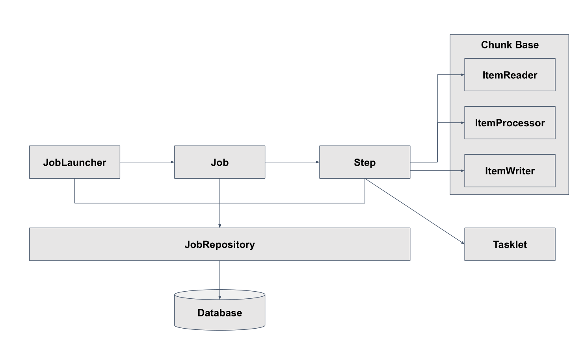

# 03. 스프링 배치 기본 구조

## 스프링 배치 기본 구조
스프링 배치는 Job타입의 빈이 생성되면 JobLauncher에 의해서 Job을 실행한다.  
Job은 Step을 실행한다.  
JobRepository는 DB 또는 메모리에 스프링 배치가 실행할 수 있도록 메타데이터를 관리하는 클래스이다.

## 스프링 배치 - Job

## 스프링 배치 - Step
