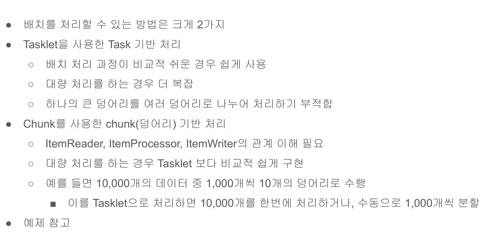
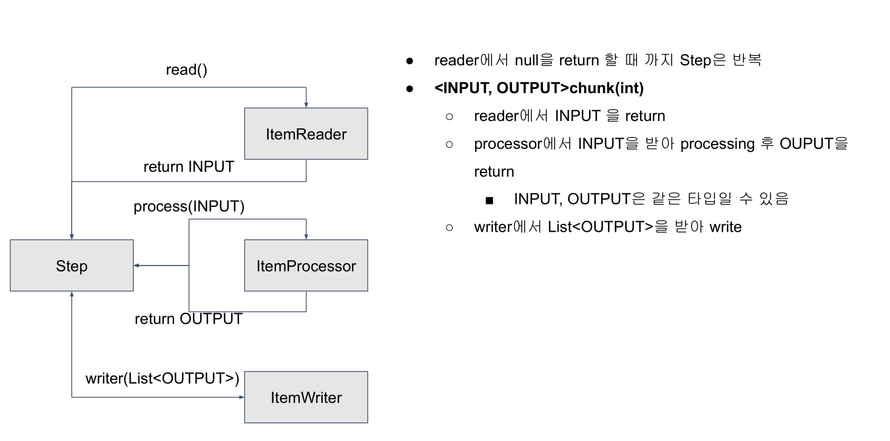

# 07. Task 기반 배치와 Chunk 기반 배치 차이점





## 예제 코드
```java
@Configuration
@Slf4j
public class  ChunkProcessingConfiguration {

    private final JobBuilderFactory jobBuilderFactory;
    private final StepBuilderFactory stepBuilderFactory;

    public ChunkProcessingConfiguration(JobBuilderFactory jobBuilderFactory,
                              StepBuilderFactory stepBuilderFactory) {
        this.jobBuilderFactory = jobBuilderFactory;
        this.stepBuilderFactory = stepBuilderFactory;
    }

    @Bean
    public Job chunkJob() {        
        return jobBuilderFactory.get("chunkJob")
                .incrementer(new RunIdIncrementer())
                .start(this.taskBaseStep())
                .start(this.chunkBaseStep())
                .build();
    }

    /** chunk 스텝 */
    @Bean
    public Step chunkBaseStep() {
        return stepBuilderFactory.get("chunkBaseStep")
                /** 100개의 데이터가 있을 경우 chunk(10)으로 하면 chunk한 덩어리아 데이터를 10개씩 나눈다는 의미 */
                .<String, String>chunk(10)
                .reader(itemReader())
                .processor(itemProcessor())
                .writer(itemWriter())
                .build();
    }
    
    private ItemReader<? extends String> itemReader() {
        /** 리스트를 이용하셔 ListItemReader 초기화 */
        return new ListItemReader<>(getItems());
    }

    private ItemProcessor<? super String, ? extends String> itemProcessor() {
        /** ItemReader에서 읽은 것들을 처리 */
        return item -> item + ", Spring Batch";
    }

    private ItemWriter<? super String> itemWriter() {
        /** ItemProcess를 거친 것을 로그로 출력 - 실무에서는 DB에 데이터를 넣거나 파일을 생성하는 처리*/
        /** 여기서는 100개를 10개씩 처리하므로 size값이 10이 10번 찍힘 */
        return items -> log.info("chunk item size : {}", items.size());
    }

    /** tasklet 스텝 */
    @Bean
    public Step taskBaseStep() {
        return stepBuilderFactory.get("taskBaseStep")
                .tasklet(this.tasklet())
                .build();
    }

    
    /** tasklet을 chunk 처리 처럼 구현 */
    /** chunk로 구현하는 것보다 코드량이 많아짐 */
    private Tasklet taskletByChunkSize() {
        List<String> items = getItems();

        return (contribution, chunkContext) -> {
            StepExecution stepExecution = contribution.getStepExecution();

            int chunkSize = 10;
            int fromIndex = stepExecution.getReadCount();
            int toIndex = fromIndex + chunkSize;

            if (fromIndex >= items.size()) {
                return RepeatStatus.FINISHED;
            }

            List<String> subList = items.subList(fromIndex, toIndex);
            log.info("task item size: {}",  subList.size());

            return RepeatStatus.CONTINUABLE;
        };
    }

    private Tasklet tasklet() {
        return (contribution, chunkContext) -> {
            List<String> items = getItems();
            log.info("task item size : {}", items.size());

            return RepeatStatus.FINISHED;
        };
    }

    private List<String> getItems() {
        List<String> items = new ArrayList<>();
        for (int i = 0; i < 100; i++) {
            items.add(i + "hello");
        }
        return items;
    }
    
}
```