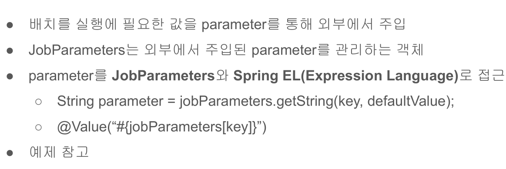

# 08. JobParameter의 이해



## JobParameters 객체를 활용한 방법
JobParameters 객체를 활용하여 parameter에 접근할 수 있고, tasklet에서만 사용할 수 있는 방법이다.
예를 들어 프로그램 실행시 `--chunkSize=10` 형태로 파라미터를 넘기면 JobParamters 객체를 통해서 값을 참조할 수 있다.

```java
    /** tasklet을 chunk 처리 처럼 구현 */
    /** chunk로 구현하는 것보다 코드량이 많아짐 */
    private Tasklet taskletByChunkSize() {
        List<String> items = getItems();

        return (contribution, chunkContext) -> {
            StepExecution stepExecution = contribution.getStepExecution();
            JobParameters jobParameters = stepExecution.getJobParameters();

            // 프로그램 실행시 --chunkSize=20 형태로 파라미터를 넘긴다.
            String value = jobParameters.getString("chunkSize", "10");
            int chunkSize = Integer.parseInt(value);
            int fromIndex = stepExecution.getReadCount();
            int toIndex = fromIndex + chunkSize;

            if (fromIndex >= items.size()) {
                return RepeatStatus.FINISHED;
            }

            List<String> subList = items.subList(fromIndex, toIndex);
            log.info("task item size: {}",  subList.size());

            return RepeatStatus.CONTINUABLE;
        };
    }
```