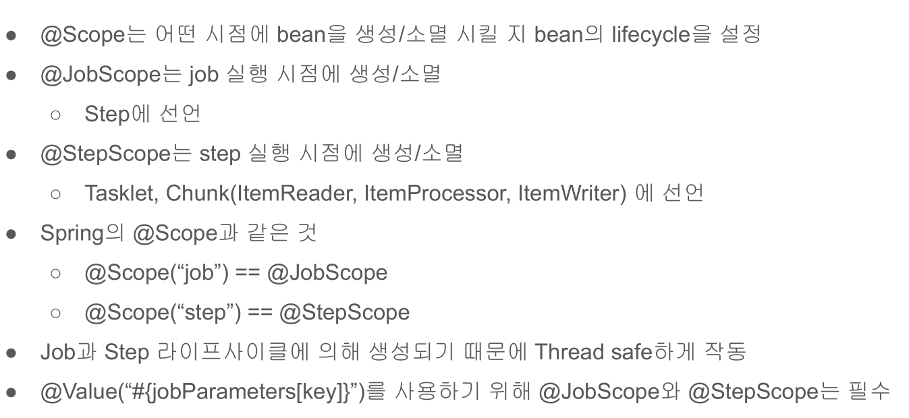

# 09. @JobScope와 @StepScope 이해

@Bean 애너테이션과 함께 Step에 @JobScope를 설정가능 @StepScope는 Tasklet, Chunk(ItemReader, ItemProcessor, ItemWriter)에 선언  
스프링의 기본 Scope는 Singletone인데 @JobScope와 @StepScope를 해당 Job이나 Step 실행시점에 스프링 빈이 생성된다.  
  
이렇게 얻을 수 있는 이점으로는 JobParameter의 Late 바인딩이 가능하여  
JobParameter가 StepContext 또는 JobExecutionContext 레벨에서 할당시킬 수 있다.

@JobScope와 @StepScope를 설정 후 메서드 파라미터에 `#{jobParameters[chunkSize]}` 같이 설정한다면,  
프로그램 실행시 arguments로 `--chunkSize=20`형태로 넘겼을 경우 `chunkSize`에 대한 값을 읽을 수 있다.  

두번째로, 동일한 컴포넌트를 병렬 혹은 동시에 사용할때 유용하다.  
Step 안에 Tasklet이 있고, 이 Tasklet은 멤버 변수와 이 멤버 변수를 변경하는 로직이 있다고 가정해보자  
이 경우 @StepScope 없이 Step을 병렬로 실행시키게 되면 서로 다른 Step에서 하나의 Tasklet을 두고 마구잡이로 상태를 변경하려고 할 것이다.  
하지만 @StepScope가 있다면 각각의 Step에서 별도의 Tasklet을 생성하고 관리하기 때문에 서로의 상태를 침범할 일이 없다.(Thread-Safe)  

[참고 자료](https://jojoldu.tistory.com/330)




## 예제코드
```java
@Configuration
@Slf4j
public class  ChunkProcessingConfiguration {

    private final JobBuilderFactory jobBuilderFactory;
    private final StepBuilderFactory stepBuilderFactory;

    public ChunkProcessingConfiguration(JobBuilderFactory jobBuilderFactory,
                              StepBuilderFactory stepBuilderFactory) {
        this.jobBuilderFactory = jobBuilderFactory;
        this.stepBuilderFactory = stepBuilderFactory;
    }

    @Bean
    public Job chunkJob() {        
        return jobBuilderFactory.get("chunkJob")
                .incrementer(new RunIdIncrementer())
                .start(this.taskBaseStep(null))
                .start(this.chunkBaseStep(null))
                .build();
    }

    @Bean
    @JobScope
    public Step chunkBaseStep(@Value("#{jobParameters[chunkSize]}") String value) {
        int chunkSize = StringUtil.hasText(value) ? Integer.parseInt(value) : 10;
        return stepBuilderFactory.get("chunkBaseStep")

                .<String, String>chunk(chunkSize)
                .reader(itemReader())
                .processor(itemProcessor())
                .writer(itemWriter())
                .build();
    }
    
    // 생략...

    /** tasklet 스텝 */
    @Bean
    @StepScope
    public Step taskBaseStep(@Value("#{jobParameters[chunkSize]}") String value) {
        return stepBuilderFactory.get("taskBaseStep")
                .tasklet(this.tasklet(value))
                .build();
    }

    
    private Tasklet tasklet(String value) {
        List<String> items = getItems();

        return (contribution, chunkContext) -> {
            StepExecution stepExecution = contribution.getStepExecution();
            JobParameters jobParameters = stepExecution.getJobParameters();

            int chunkSize = StringUtils.hasText(value) ? Integer.parseInt(value) : 10;
            int fromIndex = stepExecution.getReadCount();
            int toIndex = fromIndex + chunkSize;

            if (fromIndex >= items.size()) {
                return RepeatStatus.FINISHED;
            }

            List<String> subList = items.subList(fromIndex, toIndex);
            log.info("task item size: {}",  subList.size());

            return RepeatStatus.CONTINUABLE;
        };
    }

    private List<String> getItems() {
        List<String> items = new ArrayList<>();
        for (int i = 0; i < 100; i++) {
            items.add(i + "hello");
        }
        return items;
    }
    
}
```