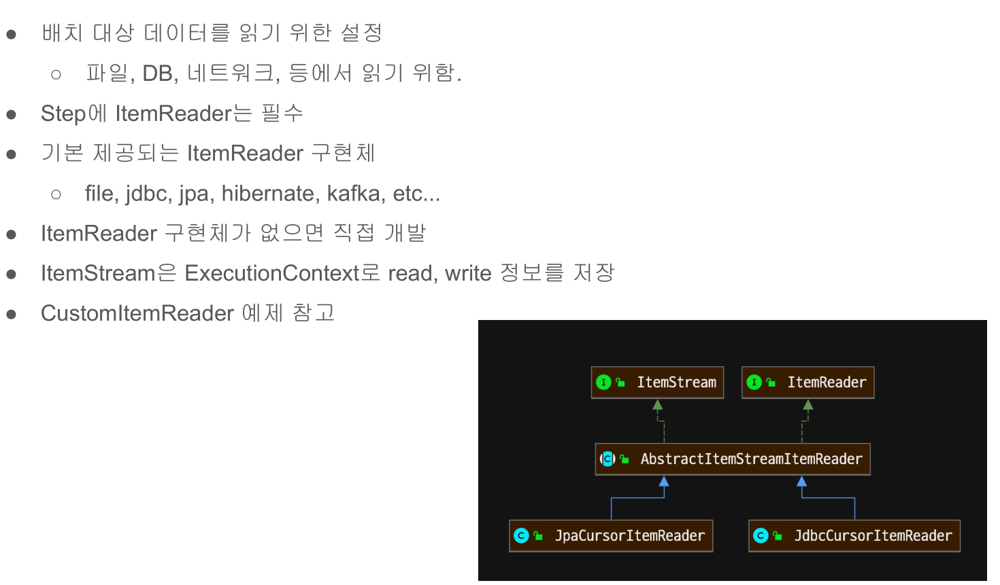

# 10. ItemReader의 이해



## ItemReader 인터페이스를 구현하기
```java
/** 자바 컬렉션의 리스트를 Reader로 처리하는 ItemReader */
public class CustomItemReader<T> implements ItemReader<T> {

    private final List<T> items;

	public CustomItemReader(List<T> items) {
		this.items = new ArrayList<>(items);
	}

	@Override
	public T read() throws Exception, UnexpectedInputException, ParseException, NonTransientResourceException {
		if (!items.isEmpty()) {
            return items.remove(0);
        }
        /** null 반환하면 chunk 반복의 끝을 나타냄 */
		return null;
	}
}
```

## 구성 클래스
```java
@Configuration
@Slf4j
public class  ItemReaderConfiguration {

    private final JobBuilderFactory jobBuilderFactory;
    private final StepBuilderFactory stepBuilderFactory;

    public ItemReaderConfiguration(JobBuilderFactory jobBuilderFactory,
                              StepBuilderFactory stepBuilderFactory) {
        this.jobBuilderFactory = jobBuilderFactory;
        this.stepBuilderFactory = stepBuilderFactory;
    }

    @Bean
    public Job itemReaderJob() {        
        return jobBuilderFactory.get("chunkJob")
                .incrementer(new RunIdIncrementer())
                .start(this.customItemReaderStep())
                .build();
    }

    @Bean
    public Step customItemReaderStep() {
        return this.stepBuilderFactory.get("customItemReaderStep")
                .<Person, Person>chunk(10)
                .reader(new CustomItemReader<>(getItems()))
                .writer(itemWriter())
                .build();
    }

    
    private ItemWriter<Person> itemWriter() {
        return items -> log.info("item size: {}, {}", items.size(), items.stream().map(Person::getName).collect(Collectors.joining(",")));
    }

    private List<Person> getItems() {
        List<Person> items = new ArrayList<>();
        for (int i = 0; i < 100; i++) {
            items.add(new Person(i + 1, "test name - " + i, "test age", "test address"));
        }
        return items;
    }
    
}
```