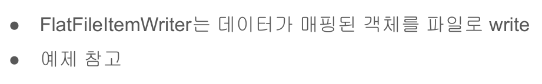

# 11. CSV 파일 읽기



## 예제
CSV 파일을 읽어들여 Person 객체로 매핑하는 배치를 작성한다.  
읽어들일 CSV 파일은 다음과 같다.

```csv
id,이름,나이,거주지
1,이경원,32,인천
2,홍길동,30,서울
3,아무개,25,강원
```

csv파일을 읽어들여 Person 객체와 매핑하여 배치처리하는 코드는 다음과 같다.

```java
Configuration
@Slf4j
public class  ItemReaderConfiguration {

    private final JobBuilderFactory jobBuilderFactory;
    private final StepBuilderFactory stepBuilderFactory;

    public ItemReaderConfiguration(JobBuilderFactory jobBuilderFactory,
                              StepBuilderFactory stepBuilderFactory) {
        this.jobBuilderFactory = jobBuilderFactory;
        this.stepBuilderFactory = stepBuilderFactory;
    }

    @Bean
    public Job itemReaderJob() throws Exception {        
        return jobBuilderFactory.get("chunkJob")
                .incrementer(new RunIdIncrementer())
                .start(this.customItemReaderStep())
                .next(this.csvFileStep())
                .build();
    }

    @Bean
    public Step customItemReaderStep() {
        return this.stepBuilderFactory.get("customItemReaderStep")
                .<Person, Person>chunk(10)
                .reader(new CustomItemReader<>(getItems()))
                .writer(itemWriter())
                .build();
    }

    @Bean
    public Step csvFileStep() throws Exception {
        return this.stepBuilderFactory.get("csvFileStep")
                .<Person, Person>chunk(10)
                .reader(csvFileItemReader())
                .writer(itemWriter())
                .build();
    }

    /** 데이터를 읽기 위한 설정을 한다. */
    private FlatFileItemReader<Person> csvFileItemReader() throws Exception {
        /** CSV 파일을 한 줄씩 읽기 위한 설정*/
        DefaultLineMapper<Person> lineMapper = new DefaultLineMapper<>();

        /** CSV 파일을 Person 객체와 매핑하기 위해 Person 필드명을 설정 */
        DelimitedLineTokenizer tokenizer = new DelimitedLineTokenizer();

        /** Person의 필드명을 설정한다. */
        tokenizer.setNames("id", "name", "age", "address");
        lineMapper.setLineTokenizer(tokenizer);

        /** CSV 라인의 값을 Person 객체와 매핑 */
        lineMapper.setFieldSetMapper(fieldSet -> {
            int id = fieldSet.readInt("id");
            String name = fieldSet.readString("name");
            String age = fieldSet.readString("age");
            String address = fieldSet.readString("address");
            return new Person(id, name, age, address);
        });

        FlatFileItemReader<Person> itemReader = new FlatFileItemReaderBuilder<Person>()
            .name("csvFileItemReader")
            .encoding("UTF-8")
            .resource(new ClassPathResource("test.csv"))
            .linesToSkip(1) /** 첫번째 라인은 skip하고 읽는 설정 */
            .lineMapper(lineMapper)
            .build();

        /** itemReader 필수 프로퍼티가 잘 설정되어 있는지 검사 */
        itemReader.afterPropertiesSet();
        return itemReader;
    }

    
    private ItemWriter<Person> itemWriter() {
        return items -> log.info("item size: {}, {}", items.size(), items.stream().map(Person::getName).collect(Collectors.joining(",")));
    }

    private List<Person> getItems() {
        List<Person> items = new ArrayList<>();
        for (int i = 0; i < 100; i++) {
            items.add(new Person(i + 1, "test name - " + i, "test age", "test address"));
        }
        return items;
    }
    
}
```
