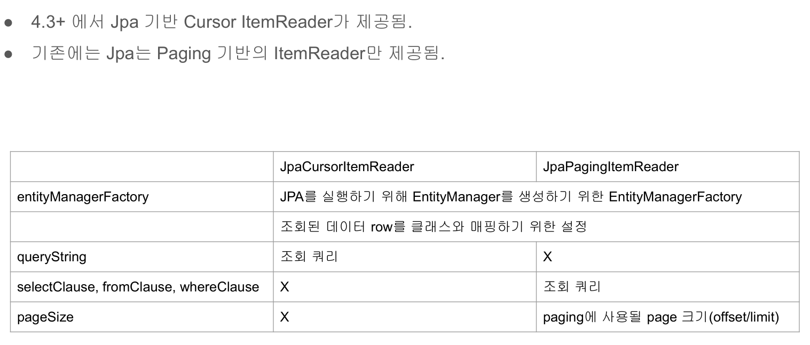

# 13. JPA 데이터 읽기




## application.yml 설정

```yml
spring:
  batch:
    job:
      names: ${job.name:chunkJob}
    initialize-schema: always
  datasource:
    driver-class-name: org.h2.Driver
    data:
    - classpath:person.sql
  jpa:
    hibernate:
      ddl-auto: create
    properties:
      hibernate:
        show_sql: true
        format_sql: true
        use_sql_comments: true
        dialect: org.hibernate.dialect.H2Dialect
        default_batch_fetch_size: 100
logging:
  level:
    batch: debug 
```

## JpaCursorItemReader 활용 예제

```java
@Configuration
@Slf4j
public class  ItemReaderConfiguration {

    private final JobBuilderFactory jobBuilderFactory;
    private final StepBuilderFactory stepBuilderFactory;

    /** JpaCursorItemReader에서 사용하기 위함*/
    private final EntityManagerFactory entityManagerFactory;

    public ItemReaderConfiguration(JobBuilderFactory jobBuilderFactory,
                              StepBuilderFactory stepBuilderFactory,
                              DataSource dataSource,
                              EntityManagerFactory entityManagerFactory) {
        this.jobBuilderFactory = jobBuilderFactory;
        this.stepBuilderFactory = stepBuilderFactory;
        this.entityManagerFactory = entityManagerFactory;
    }

    @Bean
    public Job itemReaderJob() throws Exception {        
        return jobBuilderFactory.get("chunkJob")
                .incrementer(new RunIdIncrementer())
                .start(jpaStep())
                .build();
    }

    @Bean
    public Step jpaStep() throws Exception {
        return stepBuilderFactory.get("jpaStep")
                .<Person, Person>chunk(10)
                .reader(jpaCursorItemReader())
                .writer(itemWriter())
                .build();
    }

    /** JpaCursorItemReader 생성 */
    private JpaCursorItemReader<Person> jpaCursorItemReader() throws Exception {
        JpaCursorItemReader<Person> itemReader = new JpaCursorItemReaderBuilder<Person>()
                .name("jpaCursorItemReader")
                .entityManagerFactory(entityManagerFactory)
                .queryString("select p from Person p") /** SQL이 아닌 JPQL로 작성 */
                .build();
        /** itemReader 필수 프로퍼티 세팅이 되었는지 확인 */
        itemReader.afterPropertiesSet();
        return itemReader;
    }

    private ItemWriter<Person> itemWriter() {
        return items -> log.info("item size: {}, {}", items.size(), items.stream().map(Person::getName).collect(Collectors.joining(",")));
    }

}
```


