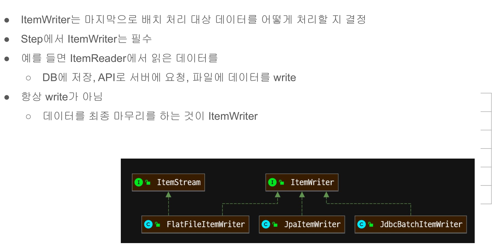

# 14. ItemWriter interface 구조 이해



```java
public interface ItemWriter<T> {

	/**
	 * Process the supplied data element. Will not be called with any null items
	 * in normal operation.
	 *
	 * @param items items to be written
	 * @throws Exception if there are errors. The framework will catch the
	 * exception and convert or rethrow it as appropriate.
	 */
	void write(List<? extends T> items) throws Exception;

}
```