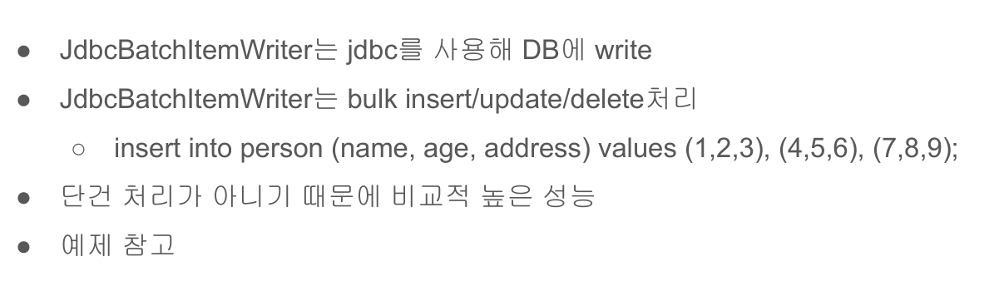

# 16. JDBC 데이터 쓰기 

mysql에서 벌크 insert를 하기위해서는 다음과 같이 `rewriteBatchedStatements=true`로 설정한다.
`jdbc:mysql://127.0.0.1:3306/spring_batch?characterEncoding=UTF-8&serverTimezone=UTC&rewriteBatchedStatement=true`



## application.yml 설정
여기서는 h2데이터베이스를 사용하기 때문에 다음과 같이 설정하였다.

```yml
spring:
  batch:
    job:
      names: ${job.name:jdbcJob}
    initialize-schema: always
  datasource:
    hikari:
      jdbc-url: jdbc:h2:tcp://localhost/~/batch
      username: sa
      password: 
      driver-class-name: org.h2.Driver
logging:
  level:
    batch: debug 
```

## person.sql 스크립트 설정
h2 데이터베이스에서 `classpath:resources/person.sql` 스크립트의 내용을 실행시키고  
테이블과 샘플데이터를 넣는다.

## 코드 예제  

DB에 저장된 데이터를 읽어서 ItemReader로 읽어서 Person객체로 변환 후  
Person객체의 내용을 다시 DB에 저장하는 코드이다.

```java
@Configuration
@Slf4j
public class  ItemReaderConfiguration {

    private final JobBuilderFactory jobBuilderFactory;
    private final StepBuilderFactory stepBuilderFactory;
    private final DataSource dataSource;

    public ItemReaderConfiguration(JobBuilderFactory jobBuilderFactory,
                              StepBuilderFactory stepBuilderFactory,
                              DataSource dataSource) {
        this.jobBuilderFactory = jobBuilderFactory;
        this.stepBuilderFactory = stepBuilderFactory;
        this.dataSource = dataSource;
    }

    @Bean
    public Job itemReaderJob() throws Exception {        
        return jobBuilderFactory.get("chunkJob")
                .incrementer(new RunIdIncrementer())
                .start(jdbcStep())
                .build();
    }

    @Bean
    public Step jdbcStep() throws Exception {
        return stepBuilderFactory.get("jdbcStep")
                .<Person, Person>chunk(10)
                .reader(JdbcCusorItemReader())
                .writer(jdbcBatchItemWriter())
                .build();
    }

    /** JdbcBatchItemWriter 작성*/
    private ItemWriter<Person> jdbcBatchItemWriter() throws Exception {
        JdbcBatchItemWriter<Person> itemWriter = new JdbcBatchItemWriterBuilder<Person>()
                                            .dataSource(dataSource)

                                            /** Person 객체의 프로퍼티를 파라미터로 자동 생성해주는 설정*/
                                            .itemSqlParameterSourceProvider(new BeanPropertyItemSqlParameterSourceProvider<>())
                                            .sql("insert into person(name, age, address) values(:name, :age, :address)")
                                            .build();
        itemWriter.afterPropertiesSet();
        return itemWriter;
    }

    /** JdbcCursorItemReader 설정 */
    private JdbcCursorItemReader<Person> JdbcCusorItemReader() throws Exception {
        JdbcCursorItemReaderBuilder<Person> itembBuilder = new JdbcCursorItemReaderBuilder<Person>();
        JdbcCursorItemReader<Person> itemReader 
                = itembBuilder
                    .name("jdbcCursorItemReader")
                    
                    /** dataSource 설정 */
                    .dataSource(dataSource)

                    /** JdbcCursorItemReader는 sql 메서드로 데이터 가져옴 */
                    .sql("select id, name, age, address from person") 

                    /** row와 객체 매핑 */
                    .rowMapper((rs, rowNum) -> {
                        return new Person(rs.getInt(1), rs.getString(2), rs.getString(3), rs.getString(4));
                    })
                    .build();
        /** 객체의 프로퍼티가 모두 올바르게 설정되어 있는 지 확인 */
        itemReader.afterPropertiesSet();
        return itemReader;
    }
}
```