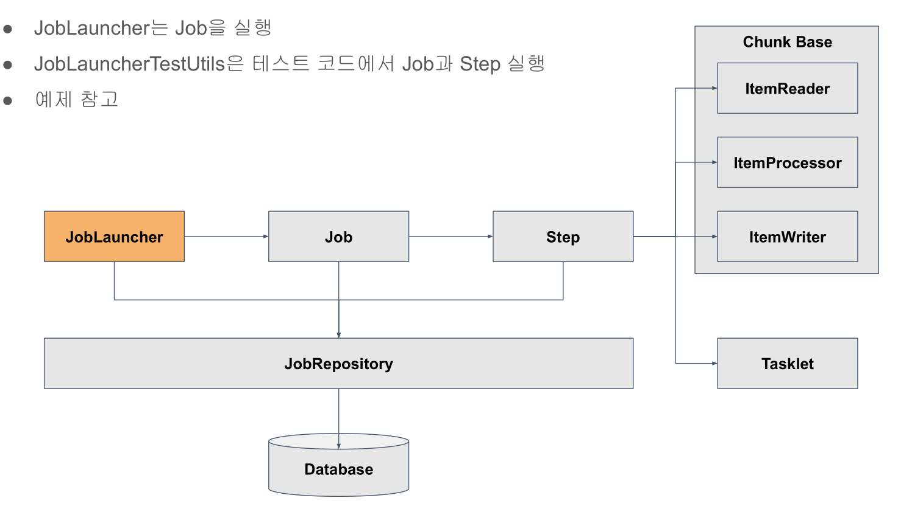

# 21. 테스트 코드 작성하기



JobLauncherTestUtils 클래스는 JobLauncher를 이용해서 테스트를 가능하게 끔 만들게 하는 클래스  
JobLauncherTestUtils 클래스는 내부적으로 JobLauncher를 포함하고 있고, 테스트 코드에서 Jobr과 Step을 자유롭게 실행할 수 있다.  
  
  
테스트 코드에서 **@EnableAutoConfiguration**을 사용하는데 이것에 관련된 내용을 다음과 같다

AutoConfiguration은 결국 Configuration이다. 즉, Bean을 등록하는 자바 설정 파일이다.  
spring.factories 내부에 여러 Configuration 들이 있고, 조건에 따라 Bean을 등록한다.  
따라서 메인 클래스(@SpringBootApplication)를 실행하면, @EnableAutoConfiguration에 의해  
spring.factories 안에 들어있는 수많은 자동 설정들이 조건에 따라 적용이 되어 수 많은 Bean들이 생성되고,  
스프링 부트 어플리케이션이 실행되는 것이다

**@SpringBatchTest** 가 테스트 코드에서 필요한 경우가 있는데 @JobScope와 @StepScope로 설정된 부분을 동작하게 하기 위해서다  
이것을 설정안하고 실행하면`org.springframework.beans.factory.support.ScopeNotActiveException`를 확인할 수 있다.


## 예제코드

@TestConfiguration
```java
@Configuration
@EnableBatchProcessing
@EnableAutoConfiguration
public class TestConfiguration {
    
    @Bean
    public JobLauncherTestUtils jobLauncherTestUtils() {
        return new JobLauncherTestUtils();
    }
}
```

@SavePersonConfigurationTest
```java
@SpringBatchTest /** @JobScope나 @StepScope로 설정된 부분이 올바르게 동작하기 위해 필요 */
@RunWith(SpringRunner.class)
@ContextConfiguration(classes = {SavePersonConfiguration.class, TestConfiguration.class})
public class SavePersonConfigurationTest {
    
    @Autowired
    private JobLauncherTestUtils jobLauncherTestUtils;

    @Autowired
    private PersonRepository personRepository;

    /** 영속성 컨텍스트의 데이터를 공유하는 것을 방지하기 위함 */
    @After
    public void tearDown() throws Exception {
        personRepository.deleteAll();
    }

    /** Step에서 Write된 총 데이터 갯수 검증 */
    @Test
    public void test_allow_duplicate() throws Exception {
        //given
        /** 테스트 job parameter 생성 */
        JobParameters jobParameters = new JobParametersBuilder()
                .addString("allow_duplicate", "true")
                .toJobParameters();
        //when
        /** jobLauncherTestUtils를 이용한 Job 실행  */
        JobExecution jobExecution = jobLauncherTestUtils.launchJob(jobParameters);

        //then
        /** N개의 StepExecution을 모두 가져와서 StepExcution에 의해 Write된 총 갯수를 검증  */
        int writeCount = jobExecution.getStepExecutions().stream().mapToInt(StepExecution::getWriteCount).sum();
        assertEquals(100, writeCount);

        /** DB에서 가져온 데이터 갯수 검증 */
        int readCount = (int)personRepository.count();
        assertEquals(100, readCount);
    }

    @Test
    public void test_allow_not_duplicate() throws Exception {
        //given
        /** 테스트 job parameter 생성 */
        JobParameters jobParameters = new JobParametersBuilder()
                .addString("allow_duplicate", "false")
                .toJobParameters();
        //when
        /** jobLauncherTestUtils를 이용한 Job 실행  */
        JobExecution jobExecution = jobLauncherTestUtils.launchJob(jobParameters);

        //then
        /** N개의 StepExecution을 모두 가져와서 StepExcution에 의해 Write된 총 갯수를 검증  */
        int writeCount = jobExecution.getStepExecutions().stream().mapToInt(StepExecution::getWriteCount).sum();
        assertEquals(22, writeCount);

        /** DB에서 가져온 데이터 갯수 검증 */
        int readCount = (int)personRepository.count();
        assertEquals(22, readCount);
    }


    /** Step 테스트 */
    @Test
    public void test_step() {
        /** step에서도 job parameter 넘길 수 있음 - launchStep(String stepName, JobParameters jobParameters)*/
        JobExecution jobExecution = jobLauncherTestUtils.launchStep("savePersonStep");
        
        /** N개의 StepExecution을 모두 가져와서 StepExcution에 의해 Write된 총 갯수를 검증  */
        int writeCount = jobExecution.getStepExecutions().stream().mapToInt(StepExecution::getWriteCount).sum();
        assertEquals(100, writeCount);

        /** DB에서 가져온 데이터 갯수 검증 */
        int readCount = (int)personRepository.count();
        assertEquals(100, readCount);
    }
}
```