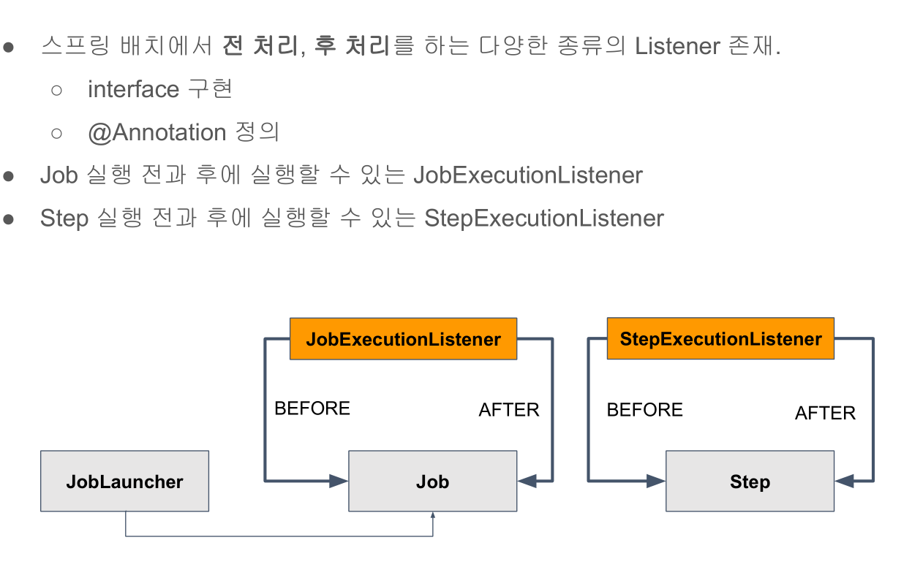

# 22. 스프링 배치에서 전처리 후처리를 위한 JobExecutionListener, StepExecutionListener 이해

구현 방식은 두가지가 있다 하나는 interface를 구현하는 것이고, 다른 하나는 @Annotation을 정의하는 것이다.



## 예제코드

### JobExecutionListener 인터페이스 구현 기반과 @Annotation 정의기반
```java
@Slf4j
public class SavePersonListener {

    /** 인터페이스 구현 기반 */
    public static class SavePersonJobExecutionListener implements JobExecutionListener {

        /** Job 수행 전 실행 */
		@Override
		public void beforeJob(JobExecution jobExecution) {
			log.info("beforeJob");
			
		}

        /** Job 수행 후 실행 */
		@Override
		public void afterJob(JobExecution jobExecution) {
            int sum = jobExecution.getStepExecutions()
                            .stream()
                            .mapToInt(StepExecution::getWriteCount)
                            .sum();

			log.info("afterJob : {} ", sum);
			
		}
        
    }

    /** 애너테이션 기반 */
    public static class SavePersonAnnotationJobExecutionListener {
        
        /** Job 수행 전 실행 */
		@BeforeJob
		public void beforeJob(JobExecution jobExecution) {
			log.info("beforeJob");
			
		}

        /** Job 수행 후 실행 */
		@AfterJob
		public void afterJob(JobExecution jobExecution) {
            int sum = jobExecution.getStepExecutions()
                            .stream()
                            .mapToInt(StepExecution::getWriteCount)
                            .sum();

			log.info("afterJob : {} ", sum);
			
		}
    }
}
```

### JobExecutionListener 등록
```java
public class SavePersonConfiguration {
    // 생략...

    @Bean
    public Job savePersonJob() throws Exception {
        return this.jobBuilderFactory.get("savePersonJob")
                .incrementer(new RunIdIncrementer())
                .start(this.savePersonStep(null))
                /** 리스너 등록 - 여러개 등록 가능하며 등록한 순으로 실행 */
                .listener(new SavePersonListener.SavePersonJobExecutionListener())
                .listener(new SavePersonListener.SavePersonAnnotationJobExecutionListener())
                .build();
    }
    // 생략...
}
```


### StepExecutionListener @Annotation 정의기반 (인터페이스는 JobExecutionListener와 동일하여 생략함)
```java
public class SavePersonListener {

    public static class SavepersonStepExecutionListener {
        @BeforeStep
        public void beforeStep(StepExecution stepExecution) {
            log.info("beforeStep");
        }

        @AfterStep
        public ExitStatus afterStep(StepExecution stepExecution) {
            log.info("after step : {}", stepExecution.getWriteCount());

            /** 스프링 배치에서는 내부적으로 Step이 실패하거나 종료할 때 상태를 StepExecution에 저장한다. */
            /** 프로그래머가 직접 ExistStatus 상태를 다음과 같이 결정할 수도 있다.*/
            if (stepExecution.getWriteCount() == 0) {
                return ExitStatus.FAILED;
            }
            return stepExecution.getExitStatus();
        }
    }
    //... 생략
```

### StepExecutionListener 등록
```java
@Configuration
@Slf4j
public class SavePersonConfiguration {
    //... 생략

    @Bean
    @JobScope
    public Step savePersonStep(@Value("#{jobParameters[allow_duplicate]?: 'true'}")Boolean allowDuplicate) throws Exception {
        return this.stepBuilderFactory.get("savePersonStep")
                .<Person, Person>chunk(10)
                .reader(itemReader())
                .processor(new DuplicateValidationProcessor<Person>(person -> person.getName(), allowDuplicate))
                .writer(JpaItemWriter())
                .listener(new SavePersonListener.SavepersonStepExecutionListener())
                .build();
    }
```

