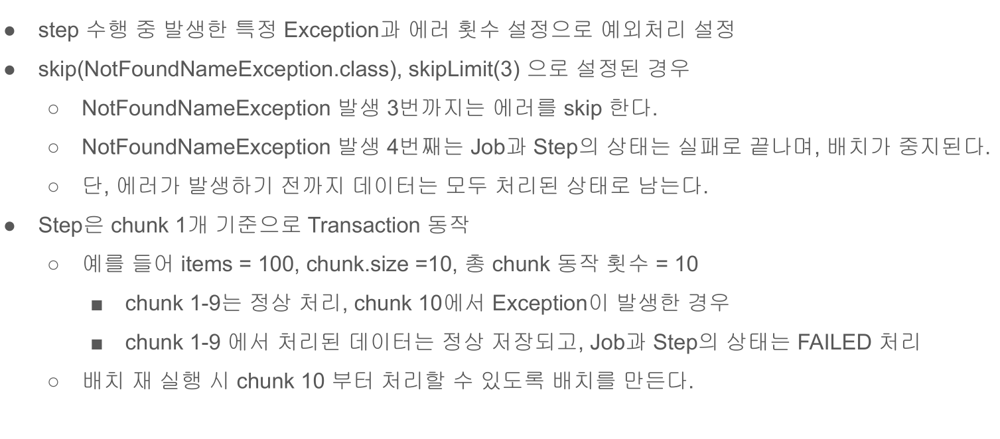
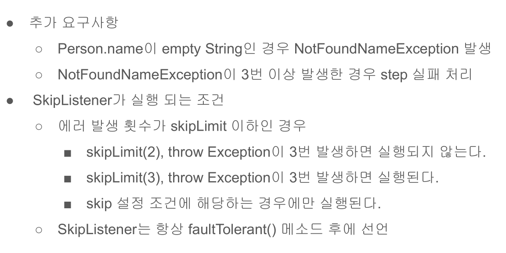

# 24. Skip 예외 처리




Skip은 Step에서 발생한 특정 예외 처리를 위한 설정이다.  
Skip은 특정 예외를 설정해 해당 예외를 N번까지 허용하겠다는 설정하겠다는 설정이 가능하다.  
N번을 초과하는 Step은 실패처리된다.  


## 예제 코드  
```java
    @Bean
    @JobScope
    public Step savePersonStep(@Value("#{jobParameters[allow_duplicate]?: 'true'}")Boolean allowDuplicate) throws Exception {
        return this.stepBuilderFactory.get("savePersonStep")
                .<Person, Person>chunk(10)
                .reader(itemReader())
                .processor(itemProcessor(allowDuplicate))
                .writer(JpaItemWriter())
                .listener(new SavePersonListener.SavepersonStepExecutionListener())

                /** SkipListener는 faultTolerant 호출 후 등록해야 동작함 */
                .faultTolerant()

                /** SkipListener는 faultTolerant 호출 후 등록해야 동작함*/
                //.listner(new SkipListener())

                /** NotFoundNameException 발생을 */
                .skip(NotFoundNameException.class)

                /** 3번까지 허용한다. */
                .skipLimit(3)
                .build();
    }

    private ItemProcessor<? super Person, ? extends Person> itemProcessor(Boolean allowDuplicate) throws Exception {
        DuplicateValidationProcessor<Person> duplicateValidationProcessor
            = new DuplicateValidationProcessor<>(Person::getName, allowDuplicate);

        /** 이름 데이터가 비어있을 경우 NotFoundNameException 발생*/
        ItemProcessor<Person, Person> validationProcessor = item -> {
            if (StringUtils.hasText(item.getName())) {
                return item;
            }
            throw new NotFoundNameException();
        };

        /** ItemProcessor가 여러개일 경우 묶는 역할을 한다. */
        CompositeItemProcessor<Person, Person> itemProcessor = new CompositeItemProcessorBuilder<Person, Person>()
                /** 등록한 순으로 ItemProcessor 실행 */
                .delegates(validationProcessor, duplicateValidationProcessor)
                .build();

        itemProcessor.afterPropertiesSet();
        return itemProcessor;
    }
```
