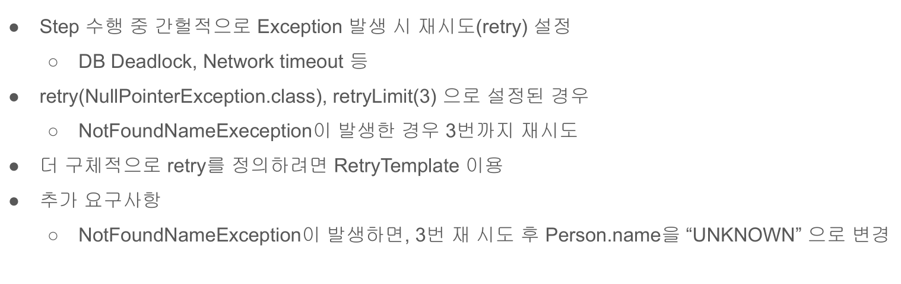
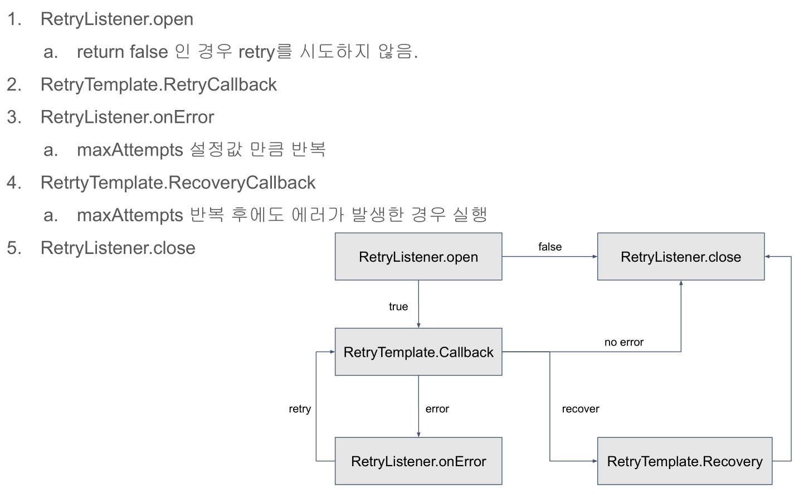

# 25. Retry 예외 처리




## retry와 retryLimit 활용 예제
```java
public class SavePersonConfiguration {
    //... 생략
    @Bean
    @JobScope
    public Step savePersonStep(@Value("#{jobParameters[allow_duplicate]?: 'true'}")Boolean allowDuplicate) throws Exception {
        return this.stepBuilderFactory.get("savePersonStep")
                .<Person, Person>chunk(10)
                .reader(itemReader())
                .processor(itemProcessor(allowDuplicate))
                .writer(JpaItemWriter())
                .listener(new SavePersonListener.SavepersonStepExecutionListener())
                .faultTolerant()
                .skip(NotFoundNameException.class)
                .skipLimit(3)
                /** retry 또한 faultTolerant를 호출한 다음에 설정해야한다. */
                .retry(NotFoundNameException.class)
                .retryLimit(3)
                .build();
    }
```

## RetryTemplate을 활용한 처리
```java
public class PersonValidationRetryProcessor implements ItemProcessor<Person, Person> {
    
    private final RetryTemplate retryTemplate;

    
	public PersonValidationRetryProcessor() {
        retryTemplate = new RetryTemplateBuilder()
                        /** 재시도 최대 횟수 */
                        .maxAttempts(3)

                        /** NotFoundNameException 발생시 재시도 함 */
                        .retryOn(NotFoundNameException.class)
                        .build();
	}


	@Override
	public Person process(Person item) throws Exception {
		return this.retryTemplate.<Person, NotFoundNameException>execute(context -> {
            //retry 콜백 - maxAttempts에 설정된 횟수만큼 retry 콜백에서 지정된 예외가 호출되면 recovery 콜백이 호출됨
            if (StringUtils.hasText(item.getName())) {
                return item;
            }
            throw new NotFoundNameException();
        }, context -> {
            //recovery 콜백
            /** 이름이 비어있는 경우 UNKNOWN으로 설정한다*/
            item.setName("UNKNOWN");
            return item;
        });
	}
}
```

```java
public class SavePersonConfiguration {
    //... 생략

    private ItemProcessor<? super Person, ? extends Person> itemProcessor(Boolean allowDuplicate) throws Exception {
        DuplicateValidationProcessor<Person> duplicateValidationProcessor
            = new DuplicateValidationProcessor<>(Person::getName, allowDuplicate);

        /** 이름 데이터가 비어있을 경우 NotFoundNameException 발생*/
        ItemProcessor<Person, Person> validationProcessor = item -> {
            if (StringUtils.hasText(item.getName())) {
                return item;
            }
            throw new NotFoundNameException();
        };

        /** ItemProcessor가 여러개일 경우 묶는 역할을 한다. */
        CompositeItemProcessor<Person, Person> itemProcessor = new CompositeItemProcessorBuilder<Person, Person>()
                /** 등록한 순으로 ItemProcessor 실행 */
                .delegates(new PersonValidationRetryProcessor(), validationProcessor, duplicateValidationProcessor)
                .build();

        itemProcessor.afterPropertiesSet();
        return itemProcessor;
    }
```

