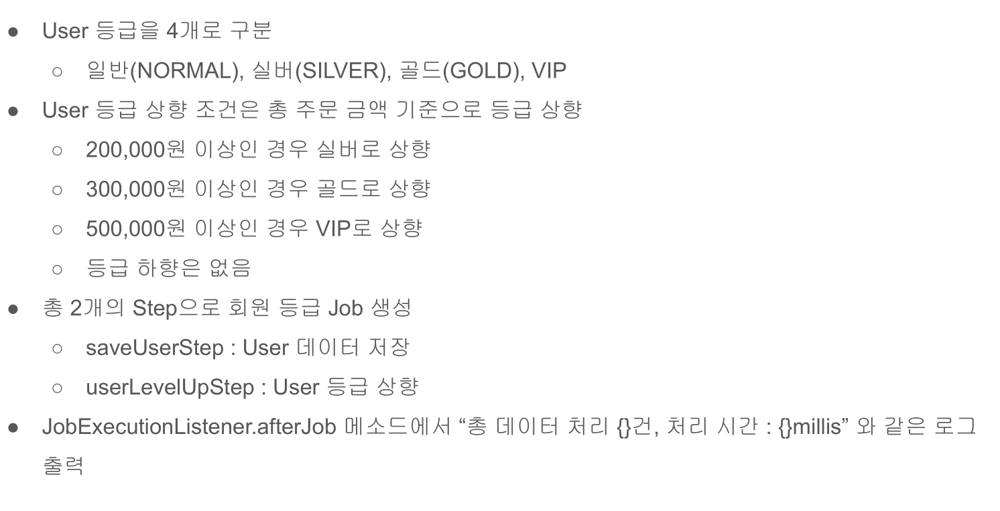

# 26. 회원등급 프로젝트

## 요구사항


## User 엔티티
```java
package batch.config.classes;

import java.util.Objects;

public enum Level {
    VIP(5000000, null),
    GOLD(4000000, VIP),
    SILVER(300000, GOLD), 
    NORMAL(200000, SILVER);

    private final int nextAmount;
    private final Level nextLevel;

    private Level(int nextAmount, Level nextLevel ) {
        this.nextAmount = nextAmount;
        this.nextLevel = nextLevel;
    }

    /** 고객의 등급이 업그레이드 가능 여부를 반환한다.*/
    public static boolean availableLevelUp(Level level, int totalAmount) {
        if (Objects.isNull(level)) {
            return false;
        }

        if (Objects.isNull(level.nextLevel)) {
            return false;
        }

        if (totalAmount >= level.nextAmount) {
            return true;
        }
        return false;
    }

    /** 고객의 총 구입 금액에 따른 고객 등급을 반환한다. */
    public static Level getNextLevel(int totalAmount) {
        if (totalAmount >= Level.VIP.nextAmount) {
            return VIP;
        }

        if (totalAmount >= Level.GOLD.nextAmount) {
            return GOLD.nextLevel;
        }

        if (totalAmount >= Level.SILVER.nextAmount) {
            return SILVER.nextLevel;
        }

        if (totalAmount >= Level.NORMAL.nextAmount) {
            return NORMAL.nextLevel;
        }
        return null;
    }
}


public enum Level {
    VIP(5000000, null),
    GOLD(4000000, VIP),
    SILVER(300000, GOLD), 
    NORMAL(200000, SILVER);

    private final int nextAmount;
    private final Level nextLevel;

    private Level(int nextAmount, Level nextLevel ) {
        this.nextAmount = nextAmount;
        this.nextLevel = nextLevel;
    }

    /** 고객의 등급이 업그레이드 가능 여부를 반환한다.*/
    public static boolean availableLevelUp(Level level, int totalAmount) {
        if (Objects.isNull(level)) {
            return false;
        }

        if (Objects.isNull(level.nextLevel)) {
            return false;
        }

        if (totalAmount >= level.nextAmount) {
            return true;
        }
        return false;
    }

    /** 고객의 총 구입 금액에 따른 고객 등급을 반환한다. */
    public static Level getNextLevel(int totalAmount) {
        if (totalAmount >= Level.VIP.nextAmount) {
            return VIP;
        }

        if (totalAmount >= Level.VIP.nextAmount) {
            return GOLD.nextLevel;
        }

        if (totalAmount >= Level.SILVER.nextAmount) {
            return SILVER.nextLevel;
        }

        if (totalAmount >= Level.NORMAL.nextAmount) {
            return NORMAL.nextLevel;
        }
        return null;
    }
}

```

## 400개의 User를 생성하는 Tasklet
```java
public class SaveUserTasklet implements Tasklet {
        
    private final UserRepository userRepository;

	public SaveUserTasklet(UserRepository userRepository) {
		this.userRepository = userRepository;
	}

	@Override
	public RepeatStatus execute(StepContribution contribution, ChunkContext chunkContext) throws Exception {
		List<User> users = createUsers();
        Collections.shuffle(users);
        userRepository.saveAll(users);
		return RepeatStatus.FINISHED;
	}

    private List<User> createUsers() {
        List<User> users = new ArrayList<>();
        /** 등급별 회원 가격정보 세팅 */
        for (int i = 1; i <= 500; i++) {
            UserBuilder userbuilder= User.builder();
            if (i <= 100) {
                userbuilder.totalAmount(10000);
            }
            else if ( i <= 200) {
                userbuilder.totalAmount(200000);
            }
            else if ( i <= 300) {
                userbuilder.totalAmount(300000);
            }
            else if ( i <= 400) {
                userbuilder.totalAmount(400000);
            }
            else {
                userbuilder.totalAmount(500000);
            }
            userbuilder.username("test username" + i);
            User user = userbuilder.build();
            users.add(user);
        }
        return users;
    }
    
}
```

## UserConfiguration 구성 클래스

데이터를 조회하는 것은 JpaPagingItemReader를 이용해서 조회하였다.

```java

@Configuration
@Slf4j
public class UserConfiguration {
    private final JobBuilderFactory jobBuilderFactory;
    private final StepBuilderFactory stepBuilderFactory;
    private final UserRepository userRepository;
    private final EntityManagerFactory entityManagerFactory;

    public UserConfiguration(JobBuilderFactory jobBuilderFactory,
                              StepBuilderFactory stepBuilderFactory,
                              UserRepository userRepository,
                              EntityManagerFactory entityManagerFactory) {
        this.jobBuilderFactory = jobBuilderFactory;
        this.stepBuilderFactory = stepBuilderFactory;
        this.userRepository = userRepository;
        this.entityManagerFactory = entityManagerFactory;
    }

    @Bean
    public Job userJob() throws Exception {
        return this.jobBuilderFactory.get("userJob")
                .incrementer(new RunIdIncrementer())
                .start(this.saveUserStep())
                .next(this.userLevelUpStep())
                .build();
    }

    @Bean
    public Step saveUserStep() throws Exception {
        return this.stepBuilderFactory.get("saveUserStep")
                .tasklet(new SaveUserTasklet(userRepository))
                .build();
    }

    @Bean
    public Step userLevelUpStep() throws Exception {
        return this.stepBuilderFactory.get("userLevelUpStep")
                .<User, User>chunk(100)
                .reader(itemReader())
                .processor(itemProcessor())
                .writer(itemWriter())
                .build();
    }

    /**Jpa Paging ItemReader를 사용함 */
    private ItemReader<? extends User> itemReader() throws Exception {
        JpaPagingItemReader<User> itemReader = new JpaPagingItemReaderBuilder<User>()
                .queryString("select u from User u")
                .entityManagerFactory(entityManagerFactory)
                .pageSize(100)

                /** name 설정 해야됨 */
                .name("userItemReader")
                .build();
        itemReader.afterPropertiesSet();
        return itemReader;
    }

    private ItemProcessor<? super User, ? extends User> itemProcessor() {
        return user -> {
            if (user.availableLevelUp()) {
                return user;
            }
            return null;
        };
    }

    private ItemWriter<? super User> itemWriter() {
        return users -> {
            users.forEach(x -> {
                x.levelUp();
                userRepository.save(x);
            });
            
        };
    }
}

```