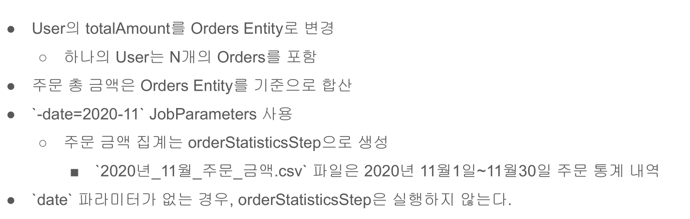

# 27. 주문 금액 집계 프로젝트



## User와 Orders 엔티티 관계 매핑

```java

@Entity
@NoArgsConstructor(access = AccessLevel.PACKAGE)
@Getter
public class User {
    @Id
    @GeneratedValue(strategy = GenerationType.IDENTITY)
    private Long id;
    private String username;
    
    @Enumerated(EnumType.STRING)
    private Level level = Level.NORMAL;

    @OneToMany(fetch = FetchType.LAZY, cascade = CascadeType.PERSIST)
    @JoinColumn(name = "user_id")
    private List<Orders> orders;
    private LocalDate updatedDate;

    @Builder
    private User(String username, List<Orders> orders) {
        this.username = username;
        this.orders = orders;
    }

    private int getTotalAmount() {
        return this.orders.stream()
                .mapToInt(Orders::getAmount)
                .sum();
    }

    public boolean availableLevelUp() {
        return Level.availableLevelUp(this.getLevel(), this.getTotalAmount());
    }

    public void levelUp() {
        Level nextLevel = Level.getNextLevel(this.getTotalAmount());
        this.level = nextLevel;
        this.updatedDate = LocalDate.now();
    }
}

@Entity
@Getter
@NoArgsConstructor
public class Orders {
    
    @Id
    @GeneratedValue(strategy = GenerationType.IDENTITY)
    private Long id;

    private String itemName;
    private int amount;

    private LocalDate createdDate;

    @Builder
    private Orders(String itemName, int amount, LocalDate createdDate) {
        this.itemName = itemName;
        this.amount = amount;
        this.createdDate = createdDate;
    }

    
}

```

##  일별 주문 합계 개발
JdbcPagingItemReader를 이용해 일별 주문 금액을 합산하고 csv 파일로 만든다.  
이때 jobParameters가 필요한다. `-date=2020-11`로 넘겨주면 된다.

```java
@Configuration
@Slf4j
public class UserConfiguration {
    private final JobBuilderFactory jobBuilderFactory;
    private final StepBuilderFactory stepBuilderFactory;
    private final UserRepository userRepository;
    private final EntityManagerFactory entityManagerFactory;
    private final DataSource dataSource;

    public UserConfiguration(JobBuilderFactory jobBuilderFactory,
                              StepBuilderFactory stepBuilderFactory,
                              UserRepository userRepository,
                              EntityManagerFactory entityManagerFactory,
                              DataSource dataSource) {
        this.jobBuilderFactory = jobBuilderFactory;
        this.stepBuilderFactory = stepBuilderFactory;
        this.userRepository = userRepository;
        this.entityManagerFactory = entityManagerFactory;
        this.dataSource = dataSource;
    }

    @Bean
    public Job userJob() throws Exception {
        return this.jobBuilderFactory.get("userJob")
                .incrementer(new RunIdIncrementer())
                .start(this.saveUserStep())
                .next(this.userLevelUpStep())
                .next(this.orderStatisticsStep(null))
                .listener(new LevelUpJobExecutionListener(userRepository))
                .build();
    }

    @Bean
    @JobScope
    public Step orderStatisticsStep(@Value("#{jobParameters[date]?: '2020-11'}") String date) throws Exception  {
        log.debug("<<<<<<<<<<<<<<<< date : {} >>>>>>>>>>>>>>>>>" , date);
        return this.stepBuilderFactory.get("orderStatisticsStep")
                .<OrderStatistics, OrderStatistics>chunk(100)
                .reader(orderStatisticsItemReader(date))
                .writer(orderStatisticsItemWriter(date))
                .build();
    }

    private ItemReader<? extends OrderStatistics> orderStatisticsItemReader(String date) throws Exception {
        /** 날짜가 12월 달일 경우 */
        YearMonth yearMonth = YearMonth.parse(date);
        Map<String, Object> parameters = new HashMap<>();
        parameters.put("startDate", yearMonth.atDay(1)); /** 12월 1일 */
        parameters.put("endDate", yearMonth.atEndOfMonth());/** 12월 31일 */

        Map<String, Order> sortKey = new HashMap<>();
        sortKey.put("created_date", Order.ASCENDING); /**created_date 필드를 기준으로 정렬 */

        /** JDBC PagingItemReader를 이용한 읽기 처리 */
        JdbcPagingItemReader<OrderStatistics> itemReader = new JdbcPagingItemReaderBuilder<OrderStatistics>()
                            .dataSource(this.dataSource)
                            .rowMapper((resultSet, i) -> 
                                OrderStatistics.builder()
                                .amount(resultSet.getString(1))
                                .date(LocalDate.parse(resultSet.getString(2), DateTimeFormatter.ISO_DATE))
                                .build())
                            .pageSize(100)
                            /**이름 설정 필요 */
                            .name("orderStatisticsItemReader")
                            .selectClause("sum(amount), created_date")
                            .fromClause("orders")
                            .whereClause("created_date >= :startDate and created_date <= :endDate")
                            .groupClause("created_date")
                            .parameterValues(parameters)
                            .sortKeys(sortKey)
                            .build();

        itemReader.afterPropertiesSet();
		return itemReader;
	}

	private ItemWriter<? super OrderStatistics> orderStatisticsItemWriter(String date) throws Exception {
        YearMonth yearMonth = YearMonth.parse(date);
        String fileName = yearMonth.getYear() + "년_" + yearMonth.getMonthValue() + "월_일별_주문_금액.csv";
        BeanWrapperFieldExtractor<OrderStatistics> fieldExtractor = new BeanWrapperFieldExtractor<OrderStatistics>();
        fieldExtractor.setNames(new String[] {"amount", "date"});

        DelimitedLineAggregator<OrderStatistics> lineAggregator = new DelimitedLineAggregator<>();
        lineAggregator.setDelimiter(",");
        lineAggregator.setFieldExtractor(fieldExtractor);
        FlatFileItemWriter<OrderStatistics> itemWriter = new FlatFileItemWriterBuilder<OrderStatistics>()
                    .resource(new FileSystemResource("output/" + fileName))
                    .lineAggregator(lineAggregator)
                    .name("orderStatisticsItemWriter")
                    .encoding("UTF-8")
                    .headerCallback(writer -> writer.write("total_amount.date"))
                    .build();
        itemWriter.afterPropertiesSet();
        return itemWriter;
	}

	@Bean
    public Step saveUserStep() throws Exception {
        return this.stepBuilderFactory.get("saveUserStep")
                .tasklet(new SaveUserTasklet(userRepository))
                .build();
    }

    @Bean
    public Step userLevelUpStep() throws Exception {
        return this.stepBuilderFactory.get("userLevelUpStep")
                .<User, User>chunk(100)
                .reader(itemReader())
                .processor(itemProcessor())
                .writer(itemWriter())
                .build();
    }

    /**Jpa Paging ItemReader를 사용함 */
    private ItemReader<? extends User> itemReader() throws Exception {
        JpaPagingItemReader<User> itemReader = new JpaPagingItemReaderBuilder<User>()
                .queryString("select u from User u")
                .entityManagerFactory(entityManagerFactory)
                .pageSize(100)

                /** name 설정 해야됨 */
                .name("userItemReader")
                .build();
        itemReader.afterPropertiesSet();
        return itemReader;
    }

    private ItemProcessor<? super User, ? extends User> itemProcessor() {
        return user -> {
            if (user.availableLevelUp()) {
                return user;
            }
            return null;
        };
    }

    private ItemWriter<? super User> itemWriter() {
        return users -> {
            users.forEach(x -> {
                x.levelUp();
                userRepository.save(x);
            });
            
        };
    }
}
```

## JobExecutionDecider로 주문 금액 집계 Step 실행 여부 결정
date 파라미터가 있으면 Step을 실행하고 없으면 실행하지 않는 것을 처리한다

```java
public class JobParametersDecide implements JobExecutionDecider {

    /** Status를 커스텀하게 재정의 */
    public static final FlowExecutionStatus CONTINUE = new FlowExecutionStatus("CONTINUE");

    /** jobParameters key에 대한 값이 있는 지 없는 지 판단 */
    private final String key;

	public JobParametersDecide(String key) {
		this.key = key;
	}

	@Override
	public FlowExecutionStatus decide(JobExecution jobExecution, StepExecution stepExecution) {
		String value = jobExecution.getJobParameters().getString(key);

        if (!StringUtils.hasText(value)) {
            return FlowExecutionStatus.COMPLETED;
        }
		return CONTINUE;
	}
    
}
```

```java
public class UserConfiguration {
    private final JobBuilderFactory jobBuilderFactory;
    private final StepBuilderFactory stepBuilderFactory;
    private final UserRepository userRepository;
    private final EntityManagerFactory entityManagerFactory;
    private final DataSource dataSource;

    public UserConfiguration(JobBuilderFactory jobBuilderFactory,
                              StepBuilderFactory stepBuilderFactory,
                              UserRepository userRepository,
                              EntityManagerFactory entityManagerFactory,
                              DataSource dataSource) {
        this.jobBuilderFactory = jobBuilderFactory;
        this.stepBuilderFactory = stepBuilderFactory;
        this.userRepository = userRepository;
        this.entityManagerFactory = entityManagerFactory;
        this.dataSource = dataSource;
    }

    @Bean
    public Job userJob() throws Exception {
        return this.jobBuilderFactory.get("userJob")
                .incrementer(new RunIdIncrementer())
                .start(this.saveUserStep())
                .next(this.userLevelUpStep())
                .listener(new LevelUpJobExecutionListener(userRepository))

                /** 다음 스템 실행전에 jobParameter date key값이 있는 지 조사 */
                .next(new JobParametersDecide("date"))

                /** JobParametersDecide에서 나온 결과값이 CONTINUE라면 */
                .on(JobParametersDecide.CONTINUE.getName())

                /** orderStatisticsStep */
                .to(this.orderStatisticsStep(null))
                .build()
                .build();
    }
```

