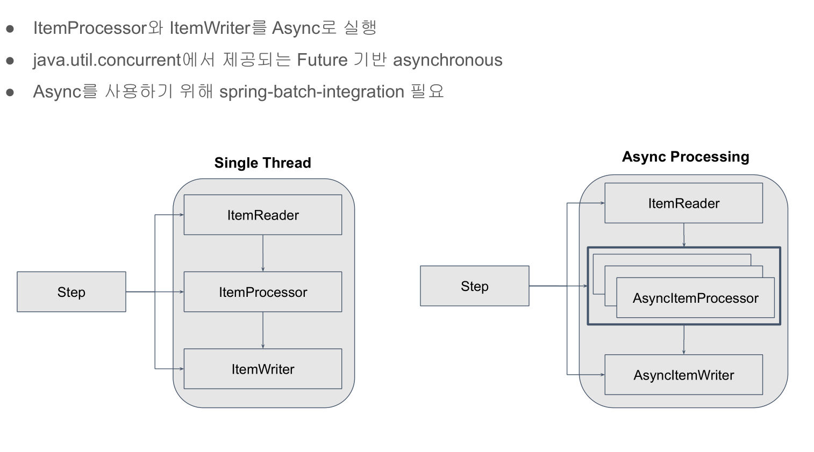

# 29. Async Step 적용하기



```gradle
dependencies {
	implementation 'org.springframework.boot:spring-boot-starter-batch'
	implementation 'org.springframework.boot:spring-boot-starter-data-jdbc'
	implementation 'org.springframework.boot:spring-boot-starter-data-jpa'

	/** spring-batch-integration 추가*/
	implementation 'org.springframework.batch:spring-batch-integration'
	compileOnly 'org.projectlombok:lombok'
	runtimeOnly 'com.h2database:h2'
	runtimeOnly 'mysql:mysql-connector-java'
	annotationProcessor 'org.projectlombok:lombok'
	testImplementation 'org.springframework.boot:spring-boot-starter-test'
	testImplementation 'org.springframework.batch:spring-batch-test'
}
```

## 예제 코드

Async로 실행되면 프로그램이 간혹 종료되지 않을때가 있기 때문에  
프로그램이 수행 후 안전하게 종료될 수 있도록 다음과 같이 코드를 적용하고,  
  
쓰레드 풀 빈을 생성한다.
```java
@SpringBootApplication
@EnableBatchProcessing
public class BatchApplication {

	public static void main(String[] args) {
		System.exit(SpringApplication.exit(SpringApplication.run(BatchApplication.class, args)));
	}

	@Bean
	@Primary /** boot에서 기본적으로 TaskExecutor빈이 존재하기 때문에 @Bean 기본빈으로 설정*/
	TaskExecutor taskExecutor() {

		/** ThreadPoolTaskExecutor - 미리 스레드풀을 만들어서 풀에서 스레드를 꺼내쓴다 */
		ThreadPoolTaskExecutor taskExecutor = new ThreadPoolTaskExecutor();
		taskExecutor.setCorePoolSize(10); /** 풀의 기본 크기 */
		taskExecutor.setMaxPoolSize(20); /** 최대 풀 크기 */
		taskExecutor.setThreadNamePrefix("batch-thread-"); /** 쓰레드 풀의 쓰레드 이름 접두어 설정 */
		taskExecutor.initialize();
		return taskExecutor;
	}
}

```

멀티 스레드 환경에서 User 엔티티의 List<Orders> orders 안정성을 위해 EAGER로 페치 타입변경
```java
@Entity
@NoArgsConstructor(access = AccessLevel.PACKAGE)
@Getter
public class User {
    @Id
    @GeneratedValue(strategy = GenerationType.IDENTITY)
    private Long id;
    private String username;
    
    @Enumerated(EnumType.STRING)
    private Level level = Level.NORMAL;

    /** 멀티스레드 환경에서 Lazy설정된 엔티티에 접근하면 Lazy로딩 에러가 발생할 수 있기 때문에 변경*/
    @OneToMany(fetch = FetchType.EAGER, cascade = CascadeType.PERSIST)
    @JoinColumn(name = "user_id")
    private List<Orders> orders;
    private LocalDate updatedDate;

    @Builder
    private User(String username, List<Orders> orders) {
        this.username = username;
        this.orders = orders;
    }

    /** 이부분 때문에 List<Orders>를 EAGER로 변경 */
    private int getTotalAmount() {
        return this.orders.stream()
                .mapToInt(Orders::getAmount)
                .sum();
    }

    public boolean availableLevelUp() {
        return Level.availableLevelUp(this.getLevel(), this.getTotalAmount());
    }

    public void levelUp() {
        Level nextLevel = Level.getNextLevel(this.getTotalAmount());
        this.level = nextLevel;
        this.updatedDate = LocalDate.now();
    }
}

```

AsyncItemProcessor와 AsyncItemWriter 적용한다.  
주의점은 chunk의 아웃풋 타입을 Future<?>로 설정해야 된다.

```java
@Configuration
@Slf4j
public class AsyncUserConfiguration {
    private final static String JOB_NAME = "asyncUserJob";
    private final JobBuilderFactory jobBuilderFactory;
    private final StepBuilderFactory stepBuilderFactory;
    private final UserRepository userRepository;
    private final EntityManagerFactory entityManagerFactory;
    private final DataSource dataSource;
    private final TaskExecutor taskExecutor;

    public AsyncUserConfiguration(JobBuilderFactory jobBuilderFactory,
                              StepBuilderFactory stepBuilderFactory,
                              UserRepository userRepository,
                              EntityManagerFactory entityManagerFactory,
                              DataSource dataSource,
                              TaskExecutor taskExecutor) {
        this.jobBuilderFactory = jobBuilderFactory;
        this.stepBuilderFactory = stepBuilderFactory;
        this.userRepository = userRepository;
        this.entityManagerFactory = entityManagerFactory;
        this.dataSource = dataSource;
        this.taskExecutor = taskExecutor;
    }
    // 생략..

    @Bean
    public Step userLevelUpStep() throws Exception {
        return this.stepBuilderFactory.get(JOB_NAME + "_userLevelUpStep")
                /** async step시 chunk의 out 타입을 Future로 변경해야 오류 안남 */
                .<User, Future<User>>chunk(100)
                .reader(itemReader())
                .processor(itemProcessor())
                .writer(itemWriter())
                .build();
    }
    // 생략...

    /** AsyncItemProcessor */
    private AsyncItemProcessor<User, User> itemProcessor() {
        ItemProcessor<User, User> itemProcessor = user -> {
            if (user.availableLevelUp()) {
                return user;
            }

            return null;
        };
       
        AsyncItemProcessor<User, User> asyncItemProcessor = new AsyncItemProcessor<User, User>();
        asyncItemProcessor.setDelegate(itemProcessor);
        asyncItemProcessor.setTaskExecutor(this.taskExecutor);
        return asyncItemProcessor;
    }

    /** AsyncItemWriter */
    private AsyncItemWriter<User> itemWriter() {
        ItemWriter<User> itemWriter = users -> {
            users.forEach(x -> {
                x.levelUp();
                userRepository.save(x);
            });
        };

        AsyncItemWriter<User> asyncItemWriter = new AsyncItemWriter<User>();
        asyncItemWriter.setDelegate(itemWriter);
        return asyncItemWriter;
    }
}
```