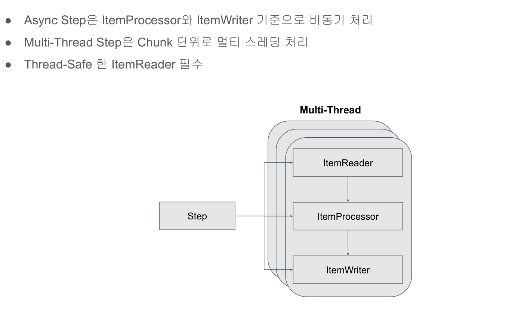

# 30. Mutli-Thread Step 적용하기

Paging 기반 ItemReader는 Thread-safe하고, Cursor기반 ItemReader는 Thread-safe하지 않다



## 예제 코드
```java
@Bean
public Step userLevelUpStep() throws Exception {
    return this.stepBuilderFactory.get(JOB_NAME + "_userLevelUpStep")
            .<User, User>chunk(100)
            .reader(itemReader())
            .processor(itemProcessor())
            .writer(itemWriter())
            /** 멀티 쓰레드 스텝 처리를 위한 taskExecutor 설정 */
            .taskExecutor(this.taskExecutor)
            
            /** 몇개의 쓰레드로 chunk를 처리할 것인지에 대한 설정 */
            .throttleLimit(8)
            .build();
}
```