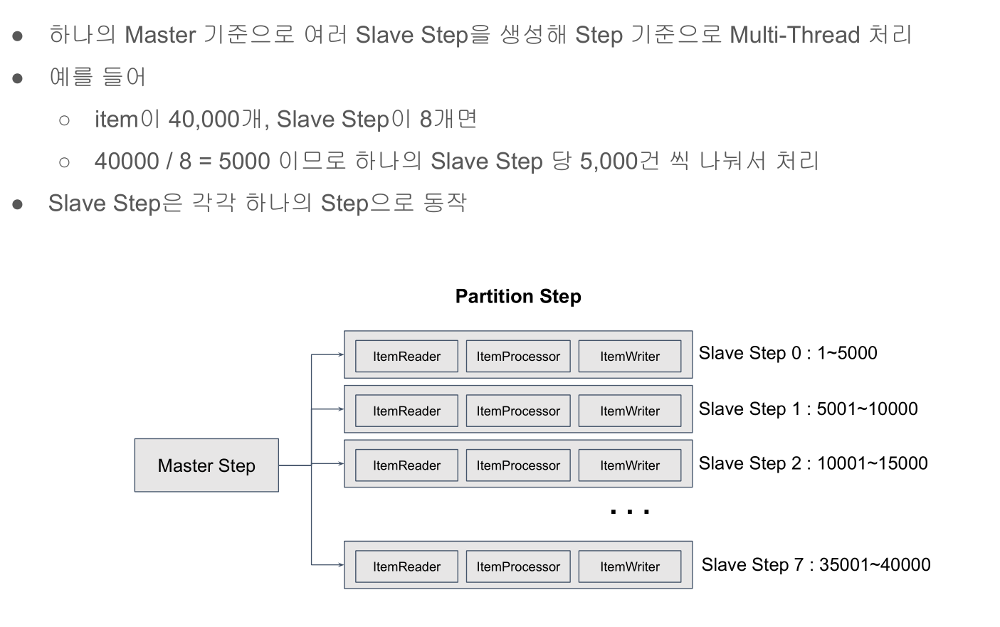

# 31. Partition Step 적용하기



## 예제코드

PartitionStep을 만들기 위한 PartitionListener 인터페이스를 구현한다.
```java
@Slf4j
public class UserLevelUpPartitioner implements Partitioner {

    private final UserRepository userRepository;

	public UserLevelUpPartitioner(UserRepository userRepository) {
		this.userRepository = userRepository;
	}

    /**
     * @param gridSize 슬레이브 스텝의 사이즈
     */
	@Override
	public Map<String, ExecutionContext> partition(int gridSize) {
        long minId = userRepository.findMinId(); // 1
        long maxId = userRepository.findMaxId(); // 400000

        long targetSize = (maxId - minId) / gridSize + 1; //5000

        /**
         * partition0 : 1, 5000
         * partition1 : 5001, 5000
         * //..
         * partitionN : 35001, 40000
         */
        Map<String, ExecutionContext> result = new HashMap<>();
        long number = 0;
        long start = minId;
        long end = start + targetSize - 1;

        while (start <= maxId) {
            ExecutionContext value = new ExecutionContext();
            result.put("partition" + number, value);
            if (end >= maxId) {
                end = maxId;
            }
            value.putLong("minId", start);
            value.putLong("maxId", end);
            start += targetSize;
            end += targetSize;
            number++;
        }
		return result;
	}
    
}
```

파티션 Step 기준을 설정하였으면 적용한다.

```java
@Configuration
@Slf4j
public class PartitionStepUserConfiguration {
    private final static String JOB_NAME = "partitionUserJob";
    private final JobBuilderFactory jobBuilderFactory;
    private final StepBuilderFactory stepBuilderFactory;
    private final UserRepository userRepository;
    private final EntityManagerFactory entityManagerFactory;
    private final DataSource dataSource;
    private final TaskExecutor taskExecutor;

    public PartitionStepUserConfiguration(JobBuilderFactory jobBuilderFactory,
                              StepBuilderFactory stepBuilderFactory,
                              UserRepository userRepository,
                              EntityManagerFactory entityManagerFactory,
                              DataSource dataSource,
                              TaskExecutor taskExecutor) {
        this.jobBuilderFactory = jobBuilderFactory;
        this.stepBuilderFactory = stepBuilderFactory;
        this.userRepository = userRepository;
        this.entityManagerFactory = entityManagerFactory;
        this.dataSource = dataSource;
        this.taskExecutor = taskExecutor;
    }

    @Bean(JOB_NAME)
    public Job userJob() throws Exception {
        return this.jobBuilderFactory.get(JOB_NAME)
                .incrementer(new RunIdIncrementer())
                .start(this.saveUserStep())

                /** Slave Step 대신 Mester Step을 Job에 설정 */
                .next(this.userLevelUpManagerStep())
                //.next(this.userLevelUpStep())
                .listener(new LevelUpJobExecutionListener(userRepository))

                /** 다음 스템 실행전에 jobParameter date key값이 있는 지 조사 */
                .next(new JobParametersDecide("date"))

                /** JobParametersDecide에서 나온 결과값이 CONTINUE라면 */
                .on(JobParametersDecide.CONTINUE.getName())

                /** orderStatisticsStep */
                .to(this.orderStatisticsStep(null))
                .build()
                .build();
    }

    @Bean
    @JobScope
    public Step orderStatisticsStep(@Value("#{jobParameters[date]}") String date) throws Exception  {
        log.debug("<<<<<<<<<<<<<<<< date : {} >>>>>>>>>>>>>>>>>" , date);
        return this.stepBuilderFactory.get(JOB_NAME + "_orderStatisticsStep")
                .<OrderStatistics, OrderStatistics>chunk(1000)
                .reader(orderStatisticsItemReader(date))
                .writer(orderStatisticsItemWriter(date))
                .build();
    }

    private ItemReader<? extends OrderStatistics> orderStatisticsItemReader(String date) throws Exception {
        /** 날짜가 12월 달일 경우 */
        YearMonth yearMonth = YearMonth.parse(date);
        Map<String, Object> parameters = new HashMap<>();
        parameters.put("startDate", yearMonth.atDay(1)); /** 12월 1일 */
        parameters.put("endDate", yearMonth.atEndOfMonth());/** 12월 31일 */

        Map<String, Order> sortKey = new HashMap<>();
        sortKey.put("created_date", Order.ASCENDING); /**created_date 필드를 기준으로 정렬 */

        /** JDBC PagingItemReader를 이용한 읽기 처리 */
        JdbcPagingItemReader<OrderStatistics> itemReader = new JdbcPagingItemReaderBuilder<OrderStatistics>()
                            .dataSource(this.dataSource)
                            .rowMapper((resultSet, i) -> 
                                OrderStatistics.builder()
                                .amount(resultSet.getString(1))
                                .date(LocalDate.parse(resultSet.getString(2), DateTimeFormatter.ISO_DATE))
                                .build())
                            .pageSize(100)
                            /**이름 설정 필요 */
                            .name("orderStatisticsItemReader")
                            .selectClause("sum(amount), created_date")
                            .fromClause("orders")
                            .whereClause("created_date >= :startDate and created_date <= :endDate")
                            .groupClause("created_date")
                            .parameterValues(parameters)
                            .sortKeys(sortKey)
                            .build();

        itemReader.afterPropertiesSet();
		return itemReader;
	}

	private ItemWriter<? super OrderStatistics> orderStatisticsItemWriter(String date) throws Exception {
        YearMonth yearMonth = YearMonth.parse(date);
        String fileName = yearMonth.getYear() + "년_" + yearMonth.getMonthValue() + "월_일별_주문_금액.csv";
        BeanWrapperFieldExtractor<OrderStatistics> fieldExtractor = new BeanWrapperFieldExtractor<OrderStatistics>();
        fieldExtractor.setNames(new String[] {"amount", "date"});

        DelimitedLineAggregator<OrderStatistics> lineAggregator = new DelimitedLineAggregator<>();
        lineAggregator.setDelimiter(",");
        lineAggregator.setFieldExtractor(fieldExtractor);
        FlatFileItemWriter<OrderStatistics> itemWriter = new FlatFileItemWriterBuilder<OrderStatistics>()
                    .resource(new FileSystemResource("output/" + fileName))
                    .lineAggregator(lineAggregator)
                    .name("orderStatisticsItemWriter")
                    .encoding("UTF-8")
                    .headerCallback(writer -> writer.write("total_amount.date"))
                    .build();
        itemWriter.afterPropertiesSet();
        return itemWriter;
	}

	@Bean
    public Step saveUserStep() throws Exception {
        return this.stepBuilderFactory.get(JOB_NAME  + "_saveUserStep")
                .tasklet(new SaveUserTasklet(userRepository))
                .build();
    }

    /** Slave Step */
    @Bean(JOB_NAME + "_userLevelUpStep")
    public Step userLevelUpStep() throws Exception {
        return this.stepBuilderFactory.get(JOB_NAME + "_userLevelUpStep")
                .<User, User>chunk(100)
                .reader(itemReader(null, null))
                .processor(itemProcessor())
                .writer(itemWriter())
                .build();
    }


    /**
     * Master Step
     */
    @Bean(JOB_NAME + "_userLevelUpStep.manager")
    public Step userLevelUpManagerStep() throws Exception {
        return this.stepBuilderFactory.get(JOB_NAME + "_userLevelUpStep.manager")

                    /** Partitioner 구현체 설정*/
                    .partitioner(JOB_NAME + "_userLevelUpStep", new UserLevelUpPartitioner(userRepository))

                    /** Slave Step 설정 */
                    .step(userLevelUpStep())
                    .partitionHandler(taskExecutorPartitionHandler())
                    .build();
    }

    @Bean
    PartitionHandler taskExecutorPartitionHandler() throws Exception {
        TaskExecutorPartitionHandler handler = new TaskExecutorPartitionHandler();
        /** Slave Step 설정 */
        handler.setStep(userLevelUpStep());

        /** taskExecutor 설정 */
        handler.setTaskExecutor(this.taskExecutor);

        /** Partitioner에서 사용될 gridSize */
        handler.setGridSize(8);
		return handler;
	}

	/** 
     * Slave Step에서 사용될 ItemReader
     * ItemReader를 빈으로 설정 후 @StepScope로 설정한다. 
     * UserLevelUpPartitioner에서 생성한 Step에 ExecutionContext를 ItemReader를 사용하기 위해서 설정
     * 
     * @StepScope는 프록시로 실행시키기 때문에 정확히 어떤 클래스로 리턴되는지 정확히 명신되어야한다.
     */
    @Bean
    @StepScope
    JpaPagingItemReader<? extends User> itemReader(@Value("#{stepExecutionContext[minId]}")Long minId, 
                                          @Value("#{stepExecutionContext[maxId]}")Long maxId) throws Exception {

        Map<String, Object> parameters = new HashMap<>();
        parameters.put("minId", minId);
        parameters.put("maxId", maxId);

        JpaPagingItemReader<User> itemReader = new JpaPagingItemReaderBuilder<User>()
                .queryString("select u from User u where u.id between :minId and :maxId")
                .entityManagerFactory(entityManagerFactory)
                .parameterValues(parameters)
                .pageSize(100)

                /** name 설정 해야됨 */
                .name("userItemReader")
                .build();
        itemReader.afterPropertiesSet();
        return itemReader;
    }

    private ItemProcessor<? super User, ? extends User> itemProcessor() {
        return user -> {
            if (user.availableLevelUp()) {
                return user;
            }
            return null;
        };
    }

    private ItemWriter<? super User> itemWriter() {
        return users -> {
            users.forEach(x -> {
                x.levelUp();
                userRepository.save(x);
            });
            
        };
    }
}
```

## 다음과 같이 각 슬레이브 Step을 Async로 만들 수 있다.
이때 chunk의 아웃풋 타입을 Future<?>로 변경해야 한다.
```java
@Configuration
@Slf4j
public class PartitionStepUserConfiguration {
    private final static String JOB_NAME = "partitionUserJob";
    private final JobBuilderFactory jobBuilderFactory;
    private final StepBuilderFactory stepBuilderFactory;
    private final UserRepository userRepository;
    private final EntityManagerFactory entityManagerFactory;
    private final DataSource dataSource;
    private final TaskExecutor taskExecutor;

    public PartitionStepUserConfiguration(JobBuilderFactory jobBuilderFactory,
                              StepBuilderFactory stepBuilderFactory,
                              UserRepository userRepository,
                              EntityManagerFactory entityManagerFactory,
                              DataSource dataSource,
                              TaskExecutor taskExecutor) {
        this.jobBuilderFactory = jobBuilderFactory;
        this.stepBuilderFactory = stepBuilderFactory;
        this.userRepository = userRepository;
        this.entityManagerFactory = entityManagerFactory;
        this.dataSource = dataSource;
        this.taskExecutor = taskExecutor;
    }

    @Bean(JOB_NAME)
    public Job userJob() throws Exception {
        return this.jobBuilderFactory.get(JOB_NAME)
                .incrementer(new RunIdIncrementer())
                .start(this.saveUserStep())

                /** Slave Step 대신 Mester Step을 Job에 설정 */
                .next(this.userLevelUpManagerStep())
                //.next(this.userLevelUpStep())
                .listener(new LevelUpJobExecutionListener(userRepository))

                /** 다음 스템 실행전에 jobParameter date key값이 있는 지 조사 */
                .next(new JobParametersDecide("date"))

                /** JobParametersDecide에서 나온 결과값이 CONTINUE라면 */
                .on(JobParametersDecide.CONTINUE.getName())

                /** orderStatisticsStep */
                .to(this.orderStatisticsStep(null))
                .build()
                .build();
    }

    @Bean
    @JobScope
    public Step orderStatisticsStep(@Value("#{jobParameters[date]}") String date) throws Exception  {
        log.debug("<<<<<<<<<<<<<<<< date : {} >>>>>>>>>>>>>>>>>" , date);
        return this.stepBuilderFactory.get(JOB_NAME + "_orderStatisticsStep")
                .<OrderStatistics, OrderStatistics>chunk(1000)
                .reader(orderStatisticsItemReader(date))
                .writer(orderStatisticsItemWriter(date))
                .build();
    }

    private ItemReader<? extends OrderStatistics> orderStatisticsItemReader(String date) throws Exception {
        /** 날짜가 12월 달일 경우 */
        YearMonth yearMonth = YearMonth.parse(date);
        Map<String, Object> parameters = new HashMap<>();
        parameters.put("startDate", yearMonth.atDay(1)); /** 12월 1일 */
        parameters.put("endDate", yearMonth.atEndOfMonth());/** 12월 31일 */

        Map<String, Order> sortKey = new HashMap<>();
        sortKey.put("created_date", Order.ASCENDING); /**created_date 필드를 기준으로 정렬 */

        /** JDBC PagingItemReader를 이용한 읽기 처리 */
        JdbcPagingItemReader<OrderStatistics> itemReader = new JdbcPagingItemReaderBuilder<OrderStatistics>()
                            .dataSource(this.dataSource)
                            .rowMapper((resultSet, i) -> 
                                OrderStatistics.builder()
                                .amount(resultSet.getString(1))
                                .date(LocalDate.parse(resultSet.getString(2), DateTimeFormatter.ISO_DATE))
                                .build())
                            .pageSize(100)
                            /**이름 설정 필요 */
                            .name("orderStatisticsItemReader")
                            .selectClause("sum(amount), created_date")
                            .fromClause("orders")
                            .whereClause("created_date >= :startDate and created_date <= :endDate")
                            .groupClause("created_date")
                            .parameterValues(parameters)
                            .sortKeys(sortKey)
                            .build();

        itemReader.afterPropertiesSet();
		return itemReader;
	}

	private ItemWriter<? super OrderStatistics> orderStatisticsItemWriter(String date) throws Exception {
        YearMonth yearMonth = YearMonth.parse(date);
        String fileName = yearMonth.getYear() + "년_" + yearMonth.getMonthValue() + "월_일별_주문_금액.csv";
        BeanWrapperFieldExtractor<OrderStatistics> fieldExtractor = new BeanWrapperFieldExtractor<OrderStatistics>();
        fieldExtractor.setNames(new String[] {"amount", "date"});

        DelimitedLineAggregator<OrderStatistics> lineAggregator = new DelimitedLineAggregator<>();
        lineAggregator.setDelimiter(",");
        lineAggregator.setFieldExtractor(fieldExtractor);
        FlatFileItemWriter<OrderStatistics> itemWriter = new FlatFileItemWriterBuilder<OrderStatistics>()
                    .resource(new FileSystemResource("output/" + fileName))
                    .lineAggregator(lineAggregator)
                    .name("orderStatisticsItemWriter")
                    .encoding("UTF-8")
                    .headerCallback(writer -> writer.write("total_amount.date"))
                    .build();
        itemWriter.afterPropertiesSet();
        return itemWriter;
	}

	@Bean
    public Step saveUserStep() throws Exception {
        return this.stepBuilderFactory.get(JOB_NAME  + "_saveUserStep")
                .tasklet(new SaveUserTasklet(userRepository))
                .build();
    }

    /** Slave Step */
    @Bean(JOB_NAME + "_userLevelUpStep")
    public Step userLevelUpStep() throws Exception {
        return this.stepBuilderFactory.get(JOB_NAME + "_userLevelUpStep")
                .<User, Future<User>>chunk(100)
                .reader(itemReader(null, null))
                .processor(itemProcessor())
                .writer(itemWriter())
                .build();
    }


    /**
     * Master Step
     */
    @Bean(JOB_NAME + "_userLevelUpStep.manager")
    public Step userLevelUpManagerStep() throws Exception {
        return this.stepBuilderFactory.get(JOB_NAME + "_userLevelUpStep.manager")

                    /** Partitioner 구현체 설정*/
                    .partitioner(JOB_NAME + "_userLevelUpStep", new UserLevelUpPartitioner(userRepository))

                    /** Slave Step 설정 */
                    .step(userLevelUpStep())
                    .partitionHandler(taskExecutorPartitionHandler())
                    .build();
    }

    @Bean
    PartitionHandler taskExecutorPartitionHandler() throws Exception {
        TaskExecutorPartitionHandler handler = new TaskExecutorPartitionHandler();
        /** Slave Step 설정 */
        handler.setStep(userLevelUpStep());

        /** taskExecutor 설정 */
        handler.setTaskExecutor(this.taskExecutor);

        /** Partitioner에서 사용될 gridSize */
        handler.setGridSize(8);
		return handler;
	}

	/** 
     * Slave Step에서 사용될 ItemReader
     * ItemReader를 빈으로 설정 후 @StepScope로 설정한다. 
     * UserLevelUpPartitioner에서 생성한 Step에 ExecutionContext를 ItemReader를 사용하기 위해서 설정
     * 
     * @StepScope는 프록시로 실행시키기 때문에 정확히 어떤 클래스로 리턴되는지 정확히 명신되어야한다.
     */
    @Bean
    @StepScope
    JpaPagingItemReader<? extends User> itemReader(@Value("#{stepExecutionContext[minId]}")Long minId, 
                                          @Value("#{stepExecutionContext[maxId]}")Long maxId) throws Exception {

        Map<String, Object> parameters = new HashMap<>();
        parameters.put("minId", minId);
        parameters.put("maxId", maxId);

        JpaPagingItemReader<User> itemReader = new JpaPagingItemReaderBuilder<User>()
                .queryString("select u from User u where u.id between :minId and :maxId")
                .entityManagerFactory(entityManagerFactory)
                .parameterValues(parameters)
                .pageSize(100)

                /** name 설정 해야됨 */
                .name("userItemReader")
                .build();
        itemReader.afterPropertiesSet();
        return itemReader;
    }

    /** AsyncItemProcessor */
    private AsyncItemProcessor<User, User> itemProcessor() {
        ItemProcessor<User, User> itemProcessor = user -> {
            if (user.availableLevelUp()) {
                return user;
            }

            return null;
        };
    
        AsyncItemProcessor<User, User> asyncItemProcessor = new AsyncItemProcessor<User, User>();
        asyncItemProcessor.setDelegate(itemProcessor);
        asyncItemProcessor.setTaskExecutor(this.taskExecutor);
        return asyncItemProcessor;
    }

    /** AsyncItemWriter */
    private AsyncItemWriter<User> itemWriter() {
        ItemWriter<User> itemWriter = users -> {
            users.forEach(x -> {
                x.levelUp();
                userRepository.save(x);
            });
        };

        AsyncItemWriter<User> asyncItemWriter = new AsyncItemWriter<User>();
        asyncItemWriter.setDelegate(itemWriter);
        return asyncItemWriter;
    }
}
```