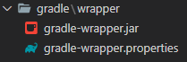

# 33. jar 파일로 만들고 실행하기 

프로젝트 베이스는 27번 프로젝트를 베이스로 한다.

## 먼저 파일 생성 경로를 파라미터로 받을 수 있도록 수정한다.  
jar로 실행하면 정확히 어떤 위치에 파일을 생성할지 명시해 주는 것이 좋다.
```java
@Configuration
@Slf4j
public class UserConfiguration {
//..생략
    @Bean
    public Job userJob() throws Exception {
        return this.jobBuilderFactory.get("userJob")
                .incrementer(new RunIdIncrementer())
                .start(this.saveUserStep())
                .next(this.userLevelUpStep())
                .listener(new LevelUpJobExecutionListener(userRepository))

                /** 다음 스템 실행전에 jobParameter date key값이 있는 지 조사 */
                .next(new JobParametersDecide("date"))

                /** JobParametersDecide에서 나온 결과값이 CONTINUE라면 */
                .on(JobParametersDecide.CONTINUE.getName())

                /** orderStatisticsStep */
                .to(this.orderStatisticsStep(null, null))
                .build()
                .build();
    }

    /**
     * JobParameter로 path 파라미터를 하나 더 추가하였다.
     */
    @Bean
    @JobScope
    public Step orderStatisticsStep(@Value("#{jobParameters[date]}") String date,
                                    @Value("#{jobParameters[path]}") String path) throws Exception  {
        log.debug("<<<<<<<<<<<<<<<< date : {} >>>>>>>>>>>>>>>>>" , date);
        return this.stepBuilderFactory.get("orderStatisticsStep")
                .<OrderStatistics, OrderStatistics>chunk(100)
                .reader(orderStatisticsItemReader(date))
                .writer(orderStatisticsItemWriter(date, path))
                .build();
    }

    //... 생략
    private ItemWriter<? super OrderStatistics> orderStatisticsItemWriter(String date, String path) throws Exception {
        YearMonth yearMonth = YearMonth.parse(date);
        String fileName = yearMonth.getYear() + "년_" + yearMonth.getMonthValue() + "월_일별_주문_금액.csv";
        BeanWrapperFieldExtractor<OrderStatistics> fieldExtractor = new BeanWrapperFieldExtractor<OrderStatistics>();
        fieldExtractor.setNames(new String[] {"amount", "date"});

        DelimitedLineAggregator<OrderStatistics> lineAggregator = new DelimitedLineAggregator<>();
        lineAggregator.setDelimiter(",");
        lineAggregator.setFieldExtractor(fieldExtractor);
        FlatFileItemWriter<OrderStatistics> itemWriter = new FlatFileItemWriterBuilder<OrderStatistics>()

                    /*path에 해당하는 디렉토리에 파일 생성하도록 변경*/
                    .resource(new FileSystemResource(path + fileName)) 
                    .lineAggregator(lineAggregator)
                    .name("orderStatisticsItemWriter")
                    .encoding("UTF-8")
                    .headerCallback(writer -> writer.write("total_amount.date"))
                    .build();
        itemWriter.afterPropertiesSet();
        return itemWriter;
	}
}
```

터미널에서 프로젝트 경로로 이동한다.  
명령어 실행시 gradle wrapper 클래스 못찾는다는 에러가 나오면 gradle-wapper.jar가 있는  
디렉터리를 프로젝트 폴더로 복사 붙여넣기 후 실행한다.  

```bash
$ cd chapter-33
$ ./gradlew clean jar build -x test # jar로 빌드는 하지만 테스트는 실행하지 않음
```

생성된 파일은 프로젝트 경로의 `build/${프로젝트명}.jar` 파일 형태로 생성된다.  
생성된 jar 파일을 실행해본다.  
```bash
$ cd build
$ cd libs
# job.name 파라미터는은 --가 두개 붙는다
# jobParameter는 -가 하나 붙는다
$ java -jar chapter-33-0.0.1-SNAPSHOT.jar --job.name=userJob -date=2020-11 -path=/c/Users/HeoJongTae/Desktop/spring_batch/chapter-33/
```
